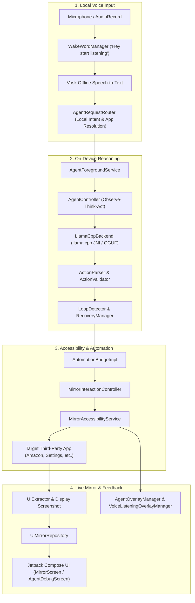
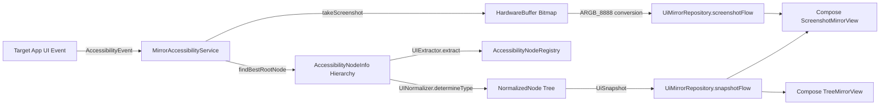
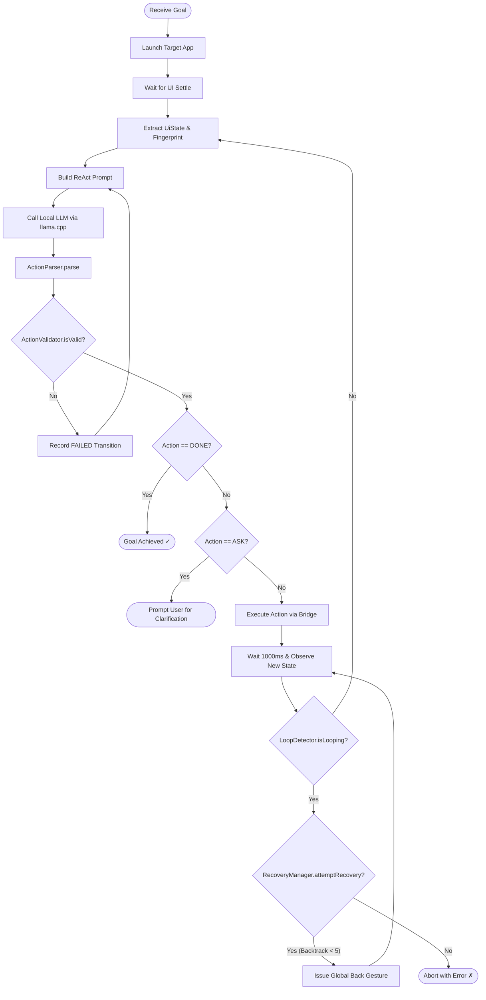

# 🔮 Teachable Voice Automation (TAV) — Mirror UI

[](https://kotlinlang.org/)
[](https://developer.android.com)
[](https://developer.android.com/jetpack/compose)
[](#on-device-llm-engine-llamacpp--jni)
[-green.svg)](#local-voice-interaction--vosk-stt)
[](#overview)

> **TAV (Mirror UI)** is an open-source, privacy-first Android assistant and remote UI mirroring platform. It runs **100% on-device** using local language models (`llama.cpp`) and local speech recognition (`Vosk`) to mirror apps, listen for voice commands, and autonomously complete multi-step tasks across third-party applications—with zero cloud servers, zero API keys, and zero telemetry.

---

## 📑 Table of Contents

- [Overview](#overview)
- [System Architecture](#system-architecture)
- [Key Features](#key-features)
- [On-Device LLM Engine (llama.cpp & JNI)](#on-device-llm-engine-llamacpp--jni)
- [Local Voice Interaction & Vosk STT](#local-voice-interaction--vosk-stt)
- [Deep Dive: Android Components](#deep-dive-android-components)
- [Data Flow & Pipelines](#data-flow--pipelines)
  - [1. Voice-Driven Autonomous Execution Flow](#1-voice-driven-autonomous-execution-flow)
  - [2. UI Extraction & Remote Mirroring Pipeline](#2-ui-extraction--remote-mirroring-pipeline)
  - [3. Touch Coordinate & Gesture Forwarding](#3-touch-coordinate--gesture-forwarding)
  - [4. Agent Reasoning, Loop Detection & Recovery](#4-agent-reasoning-loop-detection--recovery)
- [Tech Stack & Dependencies](#tech-stack--dependencies)
- [Android Configuration & Permissions](#android-configuration--permissions)
- [Setup & Build Instructions](#setup--build-instructions)
- [Known Limitations & Notes](#known-limitations--notes)

---

## Overview

Most mobile assistants rely on external cloud APIs that transmit private screen data and ambient audio off the device. **Teachable Voice Automation (TAV)** operates entirely on-device, offering a local, self-contained architecture for both UI mirroring and intelligent task automation:

1. **🔮 Remote In-App UI Mirroring (`Mirror UI`)**: Using an Android [`MirrorAccessibilityService`](app/src/main/java/com/example/teachablevoice/MirrorAccessibilityService.kt) and hardware display capture, TAV inspects third-party apps (e.g., Amazon, Zomato, Settings) and mirrors them directly inside TAV. Users can view and interact with external interfaces through a pixel-accurate **Screenshot View** (with touch target overlays and coordinate translation) or a structured **Component Tree View** (with auto-extracted controls, scroll containers, and rich card summaries).
2. **🤖 Autonomous On-Device Agent Automation (`Agent`)**: When given a high-level task (via local voice or text input, such as *"Open Amazon and find 5 packets of milk"*), TAV processes the command using **on-device Vosk speech recognition**, routes the request to target packages, launches a persistent foreground service, and runs an autonomous **Observe-Think-Act** loop powered by a **local quantized LLM ([`llama.cpp`](app/src/main/cpp/tav_llama_jni.cpp))**. The local model analyzes live UI hierarchies, emits validated JSON action commands (`CLICK`, `INPUT`, `SCROLL`, `SWIPE`, `BACK`, `DONE`, `ASK`), and drives the app to completion while rendering an unobtrusive status HUD on top of the screen.

---

## System Architecture

The project is structured into modular domain packages ensuring a clean separation between UI mirroring, accessibility bridge, on-device reasoning, and local voice interaction:



### The 4 Architectural Layers

| Layer | Key Components | What It Does |
|---|---|---|
| **Voice & STT** | [`WakeWordManager`](app/src/main/java/com/example/teachablevoice/voice/WakeWordManager.kt)<br>[`VoiceInputManager`](app/src/main/java/com/example/teachablevoice/voice/VoiceInputManager.kt)<br>[`TAVVoiceInteractionService`](app/src/main/java/com/example/teachablevoice/voice/TAVVoiceInteractionService.kt) | Captures 16kHz audio, detects `"Hey start listening"` locally, and transcribes speech using Vosk. |
| **Agent Reasoning** | [`AgentController`](app/src/main/java/com/example/teachablevoice/agent/AgentController.kt)<br>[`LlamaCppBackend`](app/src/main/java/com/example/teachablevoice/model/LlamaCppBackend.kt)<br>[`ActionParser`](app/src/main/java/com/example/teachablevoice/agent/ActionParser.kt)<br>[`LoopDetector`](app/src/main/java/com/example/teachablevoice/agent/LoopDetector.kt) | Builds prompts from UI states, generates JSON actions via local GGUF models, validates clicks, and avoids loops. |
| **Android Automation** | [`AutomationBridgeImpl`](app/src/main/java/com/example/teachablevoice/bridge/AutomationBridgeImpl.kt)<br>[`MirrorAccessibilityService`](app/src/main/java/com/example/teachablevoice/MirrorAccessibilityService.kt)<br>[`MirrorInteractionController`](app/src/main/java/com/example/teachablevoice/MirrorInteractionController.kt) | Dispatches accessibility gestures, coordinates taps, scrolls, inputs text, and navigates back/home. |
| **Mirror UI & HUD** | [`MirrorRenderer`](app/src/main/java/com/example/teachablevoice/MirrorRenderer.kt)<br>[`AgentOverlayManager`](app/src/main/java/com/example/teachablevoice/agent/AgentOverlayManager.kt)<br>[`VoiceListeningOverlayManager`](app/src/main/java/com/example/teachablevoice/voice/VoiceListeningOverlayManager.kt) | Renders the live mirrored interface in Jetpack Compose and floats status overlays over active apps. |

---

## Key Features

### 1. Dual-Mode Remote App Mirroring
- **Screenshot Mirror View** ([`ScreenshotMirrorView`](app/src/main/java/com/example/teachablevoice/MirrorRenderer.kt)):
  - Leverages Android 11+ (`Build.VERSION_CODES.R`) `AccessibilityService.takeScreenshot()` to capture hardware display buffers from the primary display.
  - Scales bitmaps dynamically to screen bounds and projects interactive bounding boxes for clickable, editable, and scrollable nodes using Compose `Canvas`.
  - Translates pointer gestures on the screenshot canvas into real screen coordinate taps, long presses, and swipes dispatched to the target app via `AccessibilityService.dispatchGesture()`.
- **Tree Mirror View** ([`TreeMirrorView`](app/src/main/java/com/example/teachablevoice/MirrorRenderer.kt)):
  - Recursively traverses accessibility node hierarchies up to 50 levels deep using [`UIExtractor`](app/src/main/java/com/example/teachablevoice/UIExtractor.kt).
  - Normalizes vendor-specific view classes into universal [`NodeType`](app/src/main/java/com/example/teachablevoice/NormalizedNode.kt) elements (`Button`, `TextField`, `Checkbox`, `Toggle`, `Dropdown`, `Image`, `List`, `Card`, `ScrollableContainer`, `Text`) via [`UINormalizer`](app/src/main/java/com/example/teachablevoice/UINormalizer.kt).
  - Preprocesses UI trees into flattened, deduplicated components with breadcrumb text extraction for complex nested layouts (e.g., restaurant cards in food delivery apps).
  - Displays interactive scroll controllers with upward/downward scroll action triggers.

### 2. In-Mirror Text Input ([`MirrorTextInputDialog`](app/src/main/java/com/example/teachablevoice/MainActivity.kt))
- When tapping an editable input field inside the mirrored screenshot view, TAV does not switch apps or trigger an IME in the background app.
- It detects `node.editable`, reads existing text and hints, and opens a modal Compose dialog (`MirrorTextInputDialog`).
- Submitted text is dispatched directly through `AccessibilityNodeInfo.ACTION_SET_TEXT` with `Bundle` arguments without invoking `ACTION_FOCUS` (which would otherwise force Android to bring the third-party app to the foreground).

### 3. Local Voice Interaction & System Digital Assistant
- Registers as an official Android [`TAVVoiceInteractionService`](app/src/main/java/com/example/teachablevoice/voice/TAVVoiceInteractionService.kt) and [`TAVVoiceInteractionSessionService`](app/src/main/java/com/example/teachablevoice/voice/TAVVoiceInteractionSessionService.kt).
- Selectable as the default **Digital Assistant App** under Android settings (`Settings.ACTION_VOICE_INPUT_SETTINGS`).
- Uses **local on-device speech recognition** through Vosk, providing low-latency, private transcription without external network requests.
- Integrated debouncing with silence detection and listening timeouts.

### 4. Local Wake-Word Engine ([`WakeWordManager`](app/src/main/java/com/example/teachablevoice/voice/WakeWordManager.kt))
- Lightweight on-device hotword detection engine tuned to `"Hey start listening"`.
- Uses fuzzy multi-keyword threshold matching (`hey`, `start`, `listening`) to tolerate pronunciation variations and interim STT outputs.
- Completely local processing—the wake phrase is detected on-device before any command parsing begins.

### 5. Natural Language Request Router ([`AgentRequestRouter`](app/src/main/java/com/example/teachablevoice/voice/AgentRequestRouter.kt))
- Transforms unstructured voice commands into structured JSON intent objects before triggering any UI interaction:
  ```json
  {
    "intent": "AUTOMATE",
    "target_app": "Amazon",
    "task": "Find 5 packets of milk",
    "parameters": { "quantity": 5, "item": "milk" }
  }
  ```
- Resolves human-readable app names to installed package names using [`AppResolver`](app/src/main/java/com/example/teachablevoice/agent/AppResolver.kt), semantic category fallbacks (e.g. "message" $\to$ SMS app, "dial" $\to$ phone app), and a dictionary of known popular applications.

### 6. Autonomous On-Device Agent Loop ([`AgentController`](app/src/main/java/com/example/teachablevoice/agent/AgentController.kt))
- **Observe-Think-Act Cycle**:
  1. Launches target application and pauses for UI settling.
  2. Extracts sanitized interactive elements ([`UiElement`](app/src/main/java/com/example/teachablevoice/agent/UiState.kt)), filtering out decorative and non-interactive views.
  3. Computes a stable screen state `fingerprint` from visible element IDs and roles.
  4. Formulates a structured system prompt containing current app package, UI fingerprint, interactive elements, recent actions, and prior failed attempts.
  5. Queries the **local LLM backend ([`LlamaCppBackend`](app/src/main/java/com/example/teachablevoice/model/LlamaCppBackend.kt))** running on device.
  6. Parses response via [`ActionParser`](app/src/main/java/com/example/teachablevoice/agent/ActionParser.kt) into one of 13 supported [`ActionType`](app/src/main/java/com/example/teachablevoice/agent/AgentAction.kt) commands:
     - `OPEN_APP`, `CLICK`, `LONG_CLICK`, `INPUT`, `SCROLL`, `SWIPE`, `BACK`, `HOME`, `RECENTS`, `NOTIFICATIONS`, `WAIT`, `DONE`, `ASK`.
  7. Validates target nodes against the current screen hierarchy ([`ActionValidator`](app/src/main/java/com/example/teachablevoice/agent/ActionValidator.kt)).
  8. Executes the action via [`AutomationBridgeImpl`](app/src/main/java/com/example/teachablevoice/bridge/AutomationBridgeImpl.kt) and waits for UI state transition.
  9. Evaluates state change (`TransitionResult.SUCCESS` vs. `NO_STATE_CHANGE`).
  10. Concludes immediately when the model outputs `{"action": "DONE"}` or requires clarification via `{"action": "ASK"}`.

### 7. Loop Detection & Heuristic Recovery
- **[`LoopDetector`](app/src/main/java/com/example/teachablevoice/agent/LoopDetector.kt)**: Monitors sliding transition histories. Detects state oscillations ($A \to B \to A \to B$) and repeated non-functional actions ($2\times \text{NO\_STATE\_CHANGE}$).
- **[`RecoveryManager`](app/src/main/java/com/example/teachablevoice/agent/RecoveryManager.kt)**: Intervenes when an agent gets stuck by issuing automatic navigation recovery (`GLOBAL_ACTION_BACK`) up to 5 times before failing gracefully.

### 8. Zero-Permission Translucent Overlays
- Avoids requiring the invasive `SYSTEM_ALERT_WINDOW` permission by using `WindowManager.LayoutParams.TYPE_ACCESSIBILITY_OVERLAY` through [`MirrorAccessibilityService`](app/src/main/java/com/example/teachablevoice/MirrorAccessibilityService.kt).
- **[`VoiceListeningOverlayManager`](app/src/main/java/com/example/teachablevoice/voice/VoiceListeningOverlayManager.kt)**: Slides down from the top to show microphone status and live transcription.
- **[`AgentOverlayManager`](app/src/main/java/com/example/teachablevoice/agent/AgentOverlayManager.kt)**: Floats at the bottom above target applications showing real-time step counts, pulsing progress indicators, and an immediate emergency stop (`■ STOP`) button.

---

## On-Device LLM Engine (llama.cpp & JNI)

TAV includes a dedicated C++ and JNI native layer enabling local inference directly on mobile hardware without external servers.

### Native JNI Bridge ([`tav_llama_jni.cpp`](app/src/main/cpp/tav_llama_jni.cpp))
- **Engine**: Embedded `llama.cpp` compiled via CMake ([`CMakeLists.txt`](app/src/main/cpp/CMakeLists.txt)) as `libtav_llama.so`.
- **Target ABI**: Optimized for 64-bit ARM (`arm64-v8a`) with C++17.
- **Memory & Context**:
  - CPU-only execution on Android (`n_gpu_layers = 0`).
  - Batch size: `n_batch = 1024`.
  - Deterministic greedy sampling (`llama_sampler_init_greedy()`) for maximum reproducibility and speed.
  - Automatic KV-cache clearing (`llama_memory_clear`) before each generation step.
  - Chunked prompt evaluation (`llama_decode`) to minimize peak memory pressure.
  - Fast JSON stop heuristic: terminates generation immediately upon encountering the closing brace `}`.

### Kotlin Backend Wrapper ([`LlamaCppBackend.kt`](app/src/main/java/com/example/teachablevoice/model/LlamaCppBackend.kt))
- Implements the common [`ModelBackend`](app/src/main/java/com/example/teachablevoice/model/ModelBackend.kt) interface:
  ```kotlin
  interface ModelBackend {
      suspend fun load()
      suspend fun generate(prompt: String): String
      suspend fun unload()
      fun isLoaded(): Boolean
  }
  ```
- Manages bundled model assets (such as `LittleLamb-290M.gguf` or compatible quantized GGUF models), copying them from APK assets to `context.filesDir` for native memory mapping.
- Dispatches prompt generation asynchronously using Kotlin coroutines on `Dispatchers.Default`.

---

## Local Voice Interaction & Vosk STT

### 1. On-Device Speech Recognition ([`VoiceInputManager`](app/src/main/java/com/example/teachablevoice/voice/VoiceInputManager.kt))
- Integrates offline speech-to-text recognition using **Vosk**.
- Operates entirely on the client device using local acoustic and language models.
- Configured with:
  - Streaming audio recognition from `AudioRecord` at 16kHz PCM.
  - Live partial results for instant feedback in the floating overlay.
  - Silence debouncing to detect the end of user utterances automatically.
- Forwards lifecycle events through [`VoiceInputListener`](app/src/main/java/com/example/teachablevoice/voice/VoiceInputListener.kt).

### 2. Audio Capture ([`AudioCaptureManager`](app/src/main/java/com/example/teachablevoice/voice/AudioCaptureManager.kt))
- Direct hardware access using `AudioRecord`:
  - Sample rate: `16,000 Hz`
  - Channel config: `AudioFormat.CHANNEL_IN_MONO`
  - Format: `AudioFormat.ENCODING_PCM_16BIT`
- Streams PCM buffers asynchronously via coroutines on `Dispatchers.IO` for local processing and low-overhead audio pipelines.

### 3. Local Wake-Word Detection ([`WakeWordManager`](app/src/main/java/com/example/teachablevoice/voice/WakeWordManager.kt))
- Constantly evaluates incoming speech text for the wake phrase `"Hey start listening"`.
- Evaluates keywords (`hey`, `start`, `listening`) with a 66% threshold (2 out of 3 keywords match).
- The wake phrase is handled purely as a local control signal and is never routed to the agent loop.

---

## Deep Dive: Android Components

| Android Component | Source File | Purpose & Implementation Details |
|---|---|---|
| **Accessibility Service** | [`MirrorAccessibilityService.kt`](app/src/main/java/com/example/teachablevoice/MirrorAccessibilityService.kt)<br>[`accessibility_service_config.xml`](app/src/main/res/xml/accessibility_service_config.xml) | Core automation spine. Subscribes to window and content changes. Extracts root views across multi-window environments (`findBestRootNode`), executes actions (`ACTION_CLICK`, `ACTION_SET_TEXT`, `ACTION_SCROLL_FORWARD`), captures display screenshots, and hosts accessibility overlays. |
| **Voice Interaction Service** | [`TAVVoiceInteractionService.kt`](app/src/main/java/com/example/teachablevoice/voice/TAVVoiceInteractionService.kt)<br>[`voice_interaction_service.xml`](app/src/main/res/xml/voice_interaction_service.xml) | System assistant service integrating with Android's voice assistant architecture. Configured with `sessionService`, `recognitionService`, and `supportsAssist="true"`. |
| **Voice Interaction Session** | [`TAVVoiceInteractionSession.kt`](app/src/main/java/com/example/teachablevoice/voice/TAVVoiceInteractionSession.kt)<br>[`TAVVoiceInteractionSessionService.kt`](app/src/main/java/com/example/teachablevoice/voice/TAVVoiceInteractionSessionService.kt) | Manages active voice interaction window. Coordinates microphone recording, local Vosk STT, and transitions to the agent automation pipeline. |
| **Foreground Service** | [`AgentForegroundService.kt`](app/src/main/java/com/example/teachablevoice/agent/AgentForegroundService.kt) | Keeps the background execution thread alive while the user is inside a target application. Declares `android:foregroundServiceType="specialUse"` and maintains an ongoing notification on `agent_channel`. |
| **Accessibility Overlay** | [`AgentOverlayManager.kt`](app/src/main/java/com/example/teachablevoice/agent/AgentOverlayManager.kt)<br>[`VoiceListeningOverlayManager.kt`](app/src/main/java/com/example/teachablevoice/voice/VoiceListeningOverlayManager.kt) | Creates programmatic layouts added directly to `WindowManager` with `TYPE_ACCESSIBILITY_OVERLAY`. Allows drawing interactive UI above other apps without `SYSTEM_ALERT_WINDOW`. |
| **Local Speech Recognizer** | [`VoiceInputManager.kt`](app/src/main/java/com/example/teachablevoice/voice/VoiceInputManager.kt) | Manages local speech-to-text with partial transcription feedback using on-device models. |
| **Gesture Injection** | [`MirrorAccessibilityService.kt`](app/src/main/java/com/example/teachablevoice/MirrorAccessibilityService.kt) | Uses `dispatchGesture()` with `GestureDescription.StrokeDescription` to inject programmatic path taps and swipe gestures at absolute screen coordinates. |
| **Native C++ / JNI** | [`CMakeLists.txt`](app/src/main/cpp/CMakeLists.txt)<br>[`tav_llama_jni.cpp`](app/src/main/cpp/tav_llama_jni.cpp)<br>[`LlamaCppBackend.kt`](app/src/main/java/com/example/teachablevoice/model/LlamaCppBackend.kt) | Native integration with `llama.cpp` using NDK 25, C++17, and ARM64-v8a ABI filters. Handles model loading from internal storage, tokenization, KV cache clearing, and token generation. |
| **Jetpack Compose UI** | [`MainActivity.kt`](app/src/main/java/com/example/teachablevoice/MainActivity.kt)<br>[`MirrorRenderer.kt`](app/src/main/java/com/example/teachablevoice/MirrorRenderer.kt)<br>[`AppLauncherScreen.kt`](app/src/main/java/com/example/teachablevoice/AppLauncherScreen.kt)<br>[`AgentDebugScreen.kt`](app/src/main/java/com/example/teachablevoice/agent/AgentDebugScreen.kt) | Modern declarative UI with single-activity navigation (`Mirror`, `Apps`, `Model`, `Agent`), custom canvas rendering, and animated state transitions. |

---

## Data Flow & Pipelines

### 1. Voice-Driven Autonomous Execution Flow

```mermaid
sequenceDiagram
    autonumber
    actor User
    participant Mic as AudioRecord / Microphone
    participant Wake as WakeWordManager
    participant Session as TAVVoiceInteractionSession
    participant LocalSTT as Vosk (Local STT)
    participant Router as AgentRequestRouter
    participant FgService as AgentForegroundService
    participant Agent as AgentController
    participant LocalLLM as LlamaCppBackend (llama.cpp)
    participant Bridge as AutomationBridgeImpl
    participant Acc as MirrorAccessibilityService
    participant Target as Target Third-Party App

    User->>Mic: "Hey start listening, open Amazon and find milk"
    Mic->>LocalSTT: 16kHz PCM stream
    LocalSTT->>Wake: Streamed speech text
    Wake->>Session: Wake phrase detected ("Hey start listening")
    Session->>LocalSTT: Transcribe user command locally
    LocalSTT-->>Session: Final Transcript: "open Amazon and find milk"
    Session->>Router: route("open Amazon and find milk")
    Router->>LocalLLM: Local intent classification prompt
    LocalLLM-->>Router: {"intent":"AUTOMATE","target_app":"Amazon","task":"find milk"}
    Router->>FgService: Start Foreground Service (task, package)
    FgService->>Agent: execute(Goal("in.amazon.mShop...", "find milk"))
    
    rect rgb(25, 25, 45)
        note right of Agent: Autonomous Execution Loop (100% On-Device)
        Agent->>Bridge: openApp("in.amazon.mShop...")
        Bridge->>Target: launchApp()
        Target-->>Acc: AccessibilityEvents
        Acc-->>Agent: UiState (elements, fingerprint)
        Agent->>LocalLLM: Prompt with current screen & goal
        LocalLLM-->>Agent: {"action":"CLICK", "element_id":"node_14"}
        Agent->>Bridge: click("node_14")
        Bridge->>Acc: performAction(ACTION_CLICK)
        Acc->>Target: Click event
        Target-->>Acc: UI updates
        Acc-->>Agent: New UiState
        Agent->>LocalLLM: Next prompt...
        LocalLLM-->>Agent: {"action":"DONE"}
    end
    Agent->>FgService: Task completed
    FgService-->>User: Notification & HUD update ("Done ✓")
```



### 2. UI Extraction & Remote Mirroring Pipeline



### 3. Touch Coordinate & Gesture Forwarding

When interacting through the **Screenshot Mirror**:
1. User taps or drags on the Compose `Image` showing the mirrored bitmap.
2. `detectTapGestures` calculates screen scale factors:
   $$\text{scaleX} = \frac{\text{screenshot.width}}{\text{view.width}}, \quad \text{scaleY} = \frac{\text{screenshot.height}}{\text{view.height}}$$
3. [`MirrorInteractionController.requestCoordinateTap(realX, realY)`](app/src/main/java/com/example/teachablevoice/MirrorInteractionController.kt) emits a coordinate command.
4. [`MirrorAccessibilityService`](app/src/main/java/com/example/teachablevoice/MirrorAccessibilityService.kt) searches the normalized tree for the deepest interactive node containing $(x, y)$:
   - **Case A (Editable Node)**: Opens [`MirrorTextInputDialog`](app/src/main/java/com/example/teachablevoice/MainActivity.kt) locally in TAV. Text is forwarded directly via `ACTION_SET_TEXT`.
   - **Case B (Clickable Node)**: Calls `node.performAction(AccessibilityNodeInfo.ACTION_CLICK)`.
   - **Case C (No Accessibility Node / Canvas View)**: Fallback to `dispatchGesture()` with a 50ms tap path at $(x, y)$.

### 4. Agent Reasoning, Loop Detection & Recovery



---

## Tech Stack & Dependencies

### Core Frameworks & Languages
- **Kotlin**: `2.2.10`
- **Android Gradle Plugin (AGP)**: `9.4.1`
- **Gradle JVM**: Java 11 target compatibility
- **Android SDK**: `minSdk = 26` (Android 8.0 Oreo), `targetSdk = 37`, `compileSdk = 37`
- **NDK**: `25.1.8937393` with CMake `3.22.1` and C++17

### Production Dependencies
| Dependency | Version | Purpose in Architecture |
|---|---|---|
| [`androidx.compose.bom`](gradle/libs.versions.toml) | `2026.02.01` | Bill of Materials ensuring harmonized Compose library versions. |
| `androidx.activity:activity-compose` | `1.8.0` | Provides Compose entrypoint (`setContent`), system back handlers, and activity result launchers. |
| `androidx.compose.material3:material3` | Dynamic | Material Design 3 UI components, themes, buttons, cards, and text fields. |
| `androidx.compose.ui:ui` & `ui-graphics` | Dynamic | Foundational UI rendering, pointer gesture detection, canvas drawing, and layout measurement. |
| `androidx.core:core-ktx` | `1.10.1` | Kotlin extensions for Android framework classes, permissions, and notifications. |
| `androidx.lifecycle:lifecycle-runtime-ktx`| `2.6.1` | Lifecycle coroutine scopes and integration with Compose state collection (`collectAsState`). |
| `org.json` | Platform | Built-in Android JSON parsing used by `ActionParser` and `AgentRequestRouter`. |

---

## Android Configuration & Permissions

From [`AndroidManifest.xml`](app/src/main/AndroidManifest.xml):

```xml
<!-- Enumerate installed applications on Android 11+ (API 30+) for app resolution -->
<uses-permission android:name="android.permission.QUERY_ALL_PACKAGES" tools:ignore="QueryAllPackagesPermission" />

<!-- Foreground execution capabilities -->
<uses-permission android:name="android.permission.FOREGROUND_SERVICE" />
<uses-permission android:name="android.permission.FOREGROUND_SERVICE_SPECIAL_USE" />
<uses-permission android:name="android.permission.FOREGROUND_SERVICE_MICROPHONE" />

<!-- Microphone audio recording for local speech-to-text -->
<uses-permission android:name="android.permission.RECORD_AUDIO" />
```

### Component Declarations
- **[`MainActivity`](app/src/main/java/com/example/teachablevoice/MainActivity.kt)**: Exported launcher activity configured with `windowSoftInputMode="adjustResize"`.
- **[`MirrorAccessibilityService`](app/src/main/java/com/example/teachablevoice/MirrorAccessibilityService.kt)**:
  - Bound via `android.permission.BIND_ACCESSIBILITY_SERVICE`.
  - Flags: `flagDefault`, `flagRetrieveInteractiveWindows`, `flagIncludeNotImportantViews`.
  - Capabilities: `canRetrieveWindowContent="true"`, `canPerformGestures="true"`.
- **[`AgentForegroundService`](app/src/main/java/com/example/teachablevoice/agent/AgentForegroundService.kt)**:
  - Internal execution service (`exported="false"`, `foregroundServiceType="specialUse"`).
- **[`TAVVoiceInteractionService`](app/src/main/java/com/example/teachablevoice/voice/TAVVoiceInteractionService.kt)**:
  - System assistant service bound via `android.permission.BIND_VOICE_INTERACTION`.
  - Configured with `supportsAssist="true"`, `supportsLaunchVoiceAssistFromKeyguard="true"`, and `supportsLocalInteraction="true"`.
- **[`TAVVoiceInteractionSessionService`](app/src/main/java/com/example/teachablevoice/voice/TAVVoiceInteractionSessionService.kt)**:
  - Session manager bound via `android.permission.BIND_VOICE_INTERACTION_SERVICE`.

---

## Setup & Build Instructions

### Prerequisites
1. **Android Studio** (Koala, Ladybug, or newer).
2. **Android SDK Platform 37** installed via SDK Manager.
3. **Android NDK** `25.1.8937393` and **CMake** `3.22.1` installed via SDK Tools.
4. An Android device or emulator running **Android 11+ (API 30+)** for screenshot mirroring and voice interaction.
5. A quantized GGUF language model (e.g. `LittleLamb-290M.gguf` or compatible small SLM) placed in the `app/src/main/assets/` directory.

### 1. Build the Project
Open terminal in the repository root:

```bash
# Build debug APK
./gradlew assembleDebug

# Install directly to connected device
./gradlew installDebug
```

### 2. Required Device Permissions & Settings
Once installed, configure the required device permissions:

1. **Enable Accessibility Service**:
   - Open **Settings** $\to$ **Accessibility** $\to$ **Downloaded Apps** (or **Installed Services**).
   - Locate **Mirror UI** and toggle it **ON**. Grant full control when prompted.
2. **Grant Microphone Permission**:
   - Launch **Mirror UI**. Tap the voice status banner at the top to grant the `RECORD_AUDIO` permission.
3. **Set Default Digital Assistant** (Optional for background voice activation):
   - Tap the voice banner or navigate to **Settings** $\to$ **Apps** $\to$ **Default Apps** $\to$ **Digital Assistant App**.
   - Select **Mirror UI** (or **Teachable Voice Automation**) as the default assist app.

---

## Known Limitations & Notes

1. **Screenshot Capture API Level**:
   - Visual screenshot capture relies on `AccessibilityService.takeScreenshot()`, which requires **Android 11 (API 30)** or higher. On Android 10 and below, TAV automatically falls back to **Tree Mirror Mode**.
2. **Foreground App Exclusions**:
   - To avoid recursive self-mirroring loops and capture corruption, [`MirrorAccessibilityService`](app/src/main/java/com/example/teachablevoice/MirrorAccessibilityService.kt) deliberately ignores events originating from `com.example.teachablevoice`, `com.android.systemui`, and launcher packages (`com.android.launcher*`).
3. **System Alert Window Alternative**:
   - TAV deliberately avoids requesting the invasive `SYSTEM_ALERT_WINDOW` permission by using `TYPE_ACCESSIBILITY_OVERLAY`. As a result, overlays can only be displayed when the accessibility service is active.
4. **Target App Rendering Latency**:
   - When switching or launching applications, TAV injects deliberate stabilization delays (e.g., 2000ms after app launch, 1000ms after UI actions) to allow third-party animations and dynamic layouts to settle before extracting the accessibility hierarchy.
5. **ABI Architecture**:
   - Native builds (`libtav_llama.so`) specify `abiFilters += listOf("arm64-v8a")`. If deploying to 32-bit ARM or x86/x86_64 emulators, adjust the ABI filters in [`app/build.gradle.kts`](app/build.gradle.kts).

---

## License

This project is licensed under the terms defined in the repository source code. See the source headers for additional details.
